```{r setup, include=FALSE}
options(htmltools.dir.version = FALSE)
# knitr::opts_chunk$set(eval = FALSE)
```

layout: false
class: middle, center

# Introduction

---
### Analysis of large spatial datasets

.left-column2[
```{r, out.width="350px", echo=FALSE}
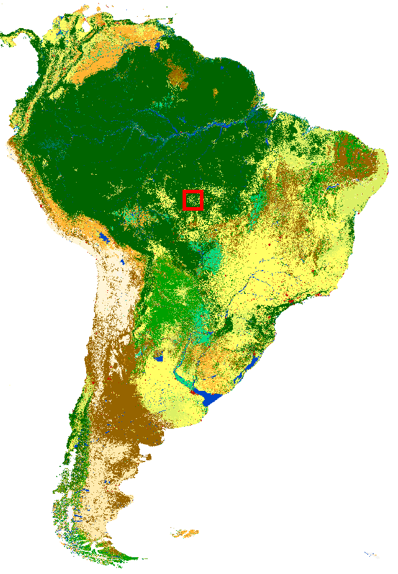
```
]
.right-column2[
```{r, out.width="375px", echo=FALSE, fig.align='center'}
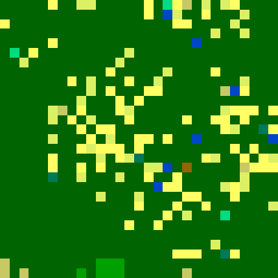
```
- High resolution spatial data at local scale **do not provide information about global properties**
- To understand global character of large spatial datasets, they need to be **analyzed in their entirety**
- It is possible with **the Pattern-Based Spatial Analysis**
]

---
### Pattern-Based Spatial Analysis

The core idea it to **transform data from a large number of cells having simple content (one value) to a much smaller number of blocks with complex content**.
In other words, decreasing a spatial resolution while increasing thematic resolution.

Many **numerical signatures** (e.g. Cartesian product, co-occurrence histogram, landscape indices vector) could represent the complex content.
It is also possible to measure distances between complex contents using **dissimilarity measures** (e.g. JSD, Euclidean distance).  

This approach enables a group of analysis to be performed on the grid of complex cells (local patterns):
- **Search** - search for areas similar to a query
- **Change detection** - comparison of local patterns between two maps
- **Segmentation** - division of a map into regions of cohesive patterns
- **Clustering** - grouping patterns that are similar to each other

```{r, out.width="1200px", echo=FALSE}
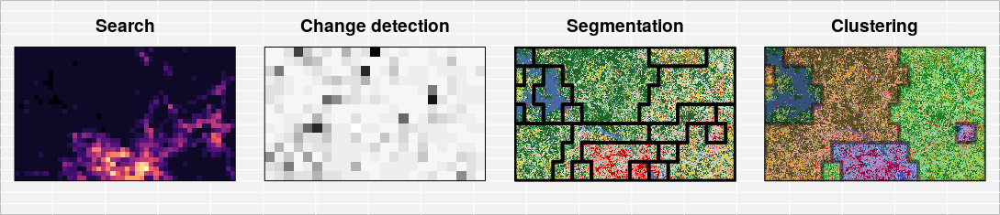
```

---
### GeoPAT 2

- **GeoPAT 2 (Geospatial Pattern Analysis Toolbox)** is a standalone suite of modules written in C. - Dedicated to the analysis of large Earth Science datasets in their entirety using spatial and/or temporal patterns.
<!-- Global scale, high-resolution spatial datasets are available but are mostly used in small pieces for local studies.  -->
<!-- GeoPAT enables studying them in their entirety. -->
- GeoPAT’s core idea is to tessellate global spatial data into a grid of square blocks of original cells (pixels).
- This transforms data from its original form (huge number of cells each having simple content) to a new form (much smaller number of supercells/blocks with complex content).
- Complex cell contains a pattern of original variable.
- GeoPAT provides means for a succinct description of such patterns and for calculation of similarity between patterns.
- This enables spatial analysis such as search, change detection, segmentation, and clustering to be performed on the grid of complex cells (local patterns).

```{r, echo=FALSE, fig.cap="Command-line interface of GeoPAT 2", out.width=800, fig.align='center'}
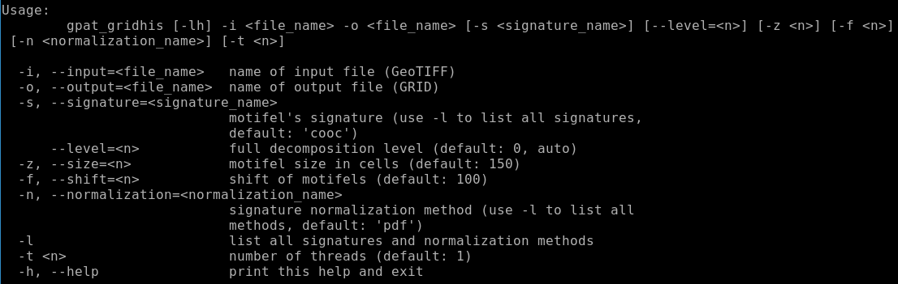
```

---
### GeoPAT 2

**GeoPAT 2** consists of twelve modules.
Five modules are designed for extracting pattern signatures from an original data grid, four modules for actual geoprocessing of the patterns, and three utility modules.

The role of signature extraction modules is to calculate pattern signatures for scenes defined:

- `gpat_gridhis`    - by a neighborhood of each cell in a grid (spatial pattern)
- `gpat_gridts`     - by a neighborhood of each cell in a grid (spatiotemporal pattern)
- `gpat_pointshis`  - in the neighborhoods of selected points (spatial pattern)
- `gpat_pointsts`   - in the neighborhoods of selected points (spatiotemporal pattern)
- `gpat_polygon`    - over irregular polygons

The role of geoprocessing modules is to perform:

- `gpat_search`     - searching
- `gpat_compare`    - comparision
- `gpat_segment`    - segmentation
- `gpat_distmtx`    - clustering

The role of utility modules is to:

- `gpat_grid2txt`   - convert grid of signatures (grid-of-scenes) from a binary to text
- `gpat_globnorm`   - normalization of grid of signatures (grid-of-scenes) values
- `gpat_segquality` - calculate the quality metrics (inhomogeneity and isolation) of a segmentation

---
layout: false
class: middle, center

# Core ideas

---
### Motifel

- Most of the spatial raster analyses use single pixels as its main unit of analysis. <!--Each pixel has one value (e.g. land cover class) and relatively small size (e.g. 90 meters).--> The value of a single pixel can show a local property, however, it says nothing about a local spatial pattern.

- <!--Therefore, the question is how a local pattern can be depicted?--> In our approach, we consider a square block of pixels as a representation of a local pattern (“motif”). This block of pixels is called a **motifel** and it is an elementary unit of the pattern-based spatial analysis.

<!-- - In the figure below, you can see a land cover map divided into a set of motifels. Each motifel consists of a large number of pixels and depicts a local pattern.-->

```{r, echo=FALSE, fig.cap="An example of a grid divided into motifels", out.width=800, fig.align='center'}
knitr::include_graphics("figs/01_motifel_grid.png")
```

---
### Motifel - size

A simple rule to decide on a size of a motifel doesn’t exist. The decision depends on the input data (e.g. its resolution, number of classes), type of a pattern, its variability, etc. However, a rule of thumb is to look closely at your data and keep in mind two things:

1. There should be enough pixels to create a pattern. That is why GeoPAT 2 does not allow for a mofitels smaller than 10 by 10 pixels.
2. Single motifels usually should not encapsulate many different patterns.

```{r, echo=FALSE, fig.cap="An example of a grid divided into motifels", out.width=800, fig.align='center'}
knitr::include_graphics("figs/01_motifel_grid.png")
```

---
### Signature

.pull-left[
- **Motifel** is a spatial data representation preferable by humans. <!--as our pattern processing capabilities were improved in millions of years of evolution.-->
- However, computers cannot see patterns in the same way as we do, and we need to transform the spatial pattern data into a form recognizable by machines.
- **GeoPAT 2** offers some of ways to do so.
They are called **signatures**.
]

.pull-right[
```{r, echo=FALSE, fig.cap="", out.width=450, fig.align='center'}
knitr::include_graphics("figs/02_signatures_examples0.png")
```
]

---
### Signature

```{r, echo=FALSE, out.width=700, fig.align='center'}
knitr::include_graphics("figs/02_signatures_examples.png")
```

- The simplest **signature** of a motifel is its composition (Cartesian product, `prod`) - a number of cells of each map category.
It is a very compact representation, although it doesn't contain information related to the configuration of categories.
- This is a role for the following **signature** - spatial co-occurrence of categories (`cooc`).
<!-- Spatial co-occurrence of categories is a $k$ by $k$ square matrix, where $k$ is a number of classes in a landscape. -->
<!-- Class co-occurrence matrix counts a number of pairs of classes assigned to neighboring cells. -->
<!-- Next, the co-occurrence matrix is transformed into a normalized co-occurrence histogram. -->
<!-- In this **signature**, a landscape with $k$ classes can be represented by the co-occurrence histogram of $(k^2 + k)/2$ elements. -->
<!-- Importantly, a $k$ number of them is related to the class composition and $(k^2 - k)/2$ is related to the class configuration. -->

---
### Signature

```{r, echo=FALSE, out.width=700, fig.align='center'}
knitr::include_graphics("figs/02_signatures_examples.png")
```

<!--Take a look at the example above and compare information depicted by the compositional and co-occurrence histograms.
The first one shows that each land cover category occupies a very similar proportion of the area.
The second one provides more information - it counts how often different categories are adjacent to each other.
These histograms also have some important properties - rotated or mirrored version of a landscape will still have the same non-spatial representation.-->

- The **signatures** mentioned above are suitable for a numeric comparison between **motifels** using **similarity metrics**.
- There are three additionals **signatures** - "landscape indices" (`lind`), "selected landscape indices" (`linds`), and "Shannon entropy" (`ent`), and their role is mostly limited to describing motifels.

---
### Similarity metric

.pull-left[
```{r, echo=FALSE, out.width=500, fig.align='center'}
knitr::include_graphics("figs/03_motifel_signatures.png")
```
]

.pull-right[
- Two of the **signatures** mentioned above, `prod` and `cooc`, have a special power - they allow for comparisons between any pair of motifels. 
<!-- In a similar way, as a human can look at two images and decide if they are similar or not, GeoPAT 2 can take two motifels and compare their **signatures**.  -->
- It also has important advantages comparing to a human perception:
    - Firstly, the GeoPAT 2 results are consistent and reproducible, while human perception can be erratic and differs between individuals.
    - Secondly, GeoPAT 2 gives a numerical value of similarity between two motifels.
]

---
### Similarity metric

.pull-left[
```{r, echo=FALSE, out.width=500, fig.align='center'}
knitr::include_graphics("figs/03_motifel_signatures.png")
```
]

.pull-right[
- To calculate a similarity between them we need to have a way to measure how these histograms are alike. - GeoPAT 2 has several **similarity metrics** that were build to compare two histograms.
<!--This numerical value depends on a selected similarity metric.-->
- It includes Jensen Shannon divergence (`jsd`), Triangular (`tri`),  Wave-Hedges distance (`wh`), and Jaccard distance (`jac`).
- They are explained in detail in [the GeoPAT 2 manual](https://zenodo.org/record/1291123).
]

---
### Similarity metric

.pull-left[
```{r, echo=FALSE, out.width=500, fig.align='center'}
knitr::include_graphics("figs/03_motifel_signatures.png")
```
]

.pull-right[
```{r, echo=FALSE, warning=FALSE}
jsd_result = structure(list(V1 = c(0, 0.114750416014047, 0.00293772511887314),
                            V2 = c(0.114750416014047, 0, 0.089399714585066),
                            V3 = c(0.00293772511887314, 0.089399714585066, 0)), 
                       row.names = c(NA, -3L), class = c("tbl_df", "tbl", "data.frame"))
knitr::kable(jsd_result, 
             digits = 3,
             row.names = c(1, 2, 3),
             col.names = c(1, 2, 3),
             caption = "Comparision of the Jensen Shannon divergence values between the example motifels (landscapes)", format = "html")
```

<!-- - I've calculated the Jensen Shannon divergence values between the three examples from the above figure. -->
- The smaller this value is the more similar are two **motifels**.
<!-- The results are, as expected, consistent with the human perception.  -->
- The first and third motifel are the most similar with the `jsd` value of 0.003 - both motifels have only three categories and their patterns are analogous.
- The second motifel is less similar to both the first one (the `jsd` value of 0.115) and the third one (the `jsd` value of 0.089). 
It has an additional land cover category ("grassland"), different proportions of land cover categories and their configurations.
]


---
layout: false
class: middle, center

# Installation

---
## Installation

**Windows installer**

The Windows x64 installer is available at http://sil.uc.edu/cms/data/uploads/software_data/GPAT2/GPAT2setup.exe

**Building from source code**

To build **GeoPAT** 2 from the source code, the development files for GDAL are required.
They can be installed on Ubuntu using:

```bash
sudo add-apt-repository ppa:ubuntugis/ubuntugis-unstable --yes
sudo apt-get --yes --force-yes update -qq
sudo apt-get install --yes libgdal-dev
```
... or on Fedora with:

```bash
sudo dnf install gdal-devel
```

The source code of **GeoPAT** 2 is available at https://github.com/Nowosad/geopat2/archive/master.zip. 
This archive should be unpacked, compiled and installed:

```bash
make
sudo make install
```

---
## Installation

Some examples also use **rgeopat2** - [an R package with additional functions for GeoPAT 2](https://github.com/Nowosad/rgeopat2):

```{r, eval=FALSE}
install.packages("rgeopat2")
```

```{r, echo=FALSE, out.width=800, fig.align='center'}
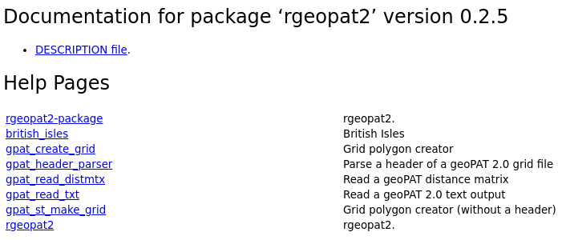
```

---
layout: false
class: middle, center

# Datasets

---
## Datasets

.pull-left[
```{r, echo=FALSE, out.width=450, fig.align='center'}
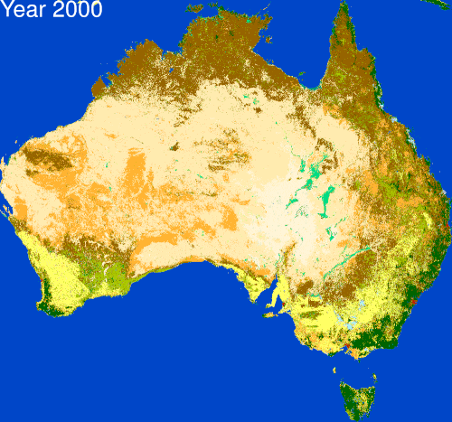
```
]

.pull-right[

Australia:
- [cci_lc2015.tif](http://sil.uc.edu/cms/data/uploads/software_data/gpat2bp/cci_lc2015.zip) - CCI Land Cover dataset in 2015
- [cci_lc2000.tif](http://sil.uc.edu/cms/data/uploads/software_data/gpat2bp/cci_lc2000.zip) - CCI Land Cover dataset in 2015
- [tnc_terr_ecoregions.tif](http://sil.uc.edu/cms/data/uploads/software_data/gpat2bp/tnc_terr_ecoregions.zip) - TNC Terrestrial Ecoregions

```{r, echo=FALSE, out.width=400, fig.align='center'}
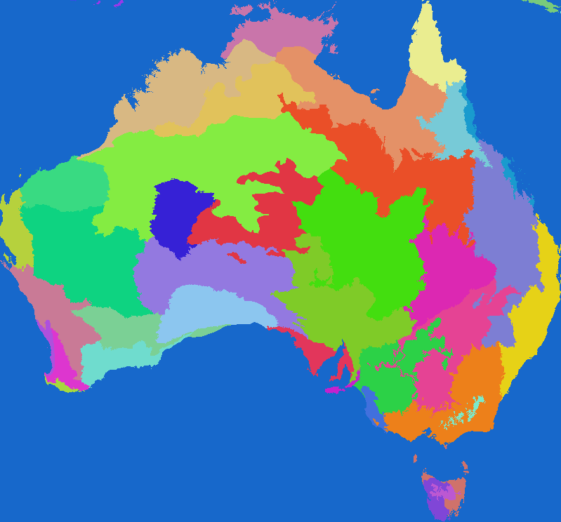
```
]

---
layout: false
class: middle, center

# Search

---
### Search

- Convenient search engines (such as [Google](https://www.google.com/) or [DuckDuckGo](https://duckduckgo.com/)) are essential tools in everyday life. 
<!-- We check the news, look for the products reviews, or find the way [how to make solar eclipse glasses](https://trends.google.com/trends/yis/2017/GLOBAL/). -->
Most of our searches have one thing in common though - they are based on text phrases.
Additionally, some less common search methods are possible, including [reverse image search](https://support.google.com/websearch/answer/1325808).

- Spatial data analysis also offers several distinct ways to search. 
Some only depends on [values in a vector's attribute table](http://geocompr.robinlovelace.net/attr.html#vector-attribute-subsetting) or [raster's values](http://geocompr.robinlovelace.net/attr.html#raster-subsetting). 
There are also methods that search based on spatial properties of the data, for example, how [an object relate in space to another one](http://geocompr.robinlovelace.net/spatial-operations.html#spatial-subsetting).
You can look for intersections, touches, is within, etc.
Finally, it is possible to search by distance.

```{r, echo=FALSE, out.width=1000, fig.align='center'}
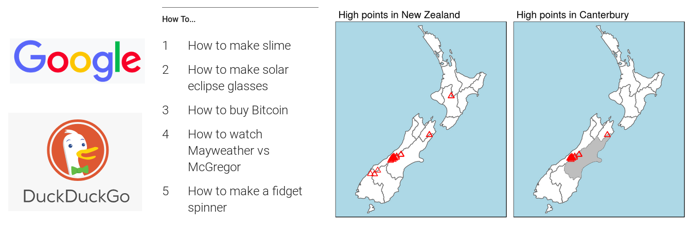
```

<!-- add images -->

---
### Search

<!-- Can you guess what are we missing in this long list? -->
<!-- Yes, you're (probably) right! -->
- Finding places with similar spatial patterns is not a standard spatial operation.
- It could be useful to solve many potential questions. 
For example, you observed some ecological process and assume that it depends on a pattern of land cover.
Next, you need to find and study areas of similar land cover patterns to validate your results.
- Fortunately, finding similar spatial patterns is one of the **GeoPAT 2** main features.

It consists of three steps:

1. Extracting local pattern features of a query (location of interest).
2. Creating a grid of motifels.
3. Comparing a query and a grid of motifels.

---
### Search

.left-column2[
- Spatial pattern search requires just two things - **a query** (location of interest) and **a context** (the same data of a larger area).
- In this example, we use **a 6 by 6 km site in Pilliga Forests in New South Wales, Australia** as our location of interest.
<!-- - This area is mostly occupied by evergreen and deciduous broad-leaved forest, but also has a few smaller patches of shrublands. -->
]

.right-column2[
```{r, echo=FALSE, out.width=700, fig.align='center'}
knitr::include_graphics("figs/search01.png")
```
]

---
### Search - step 1

In the first step, we need to convert this map (spatial patterns of categories) into a numerical **signature**  using the `gpat_pointshis` module.
It requires a number of parameters:

* `-i` - an input map covering the whole area that we want to be searched
* `-o` - a name of the output text file containing **a signature** of the query
* `-s` - a representation of the query (a type of **signature**)
* `-x` and `-y` - x and y coordinates of the query (alternatively, a file with coordinates can be provided with `--xy_file=<file_name>`)
* `-z` - a size of the query in pixels

```{bash, eval = FALSE}
gpat_pointshis -i cci_lc2015.tif -o query_signature.txt -s cooc -x 1457570 -y -3562186 -z 20
```

In this example:
- A land cover dataset with a resolution of 300 meters and covering Australia is our input map.
- We selected the spatial co-occurrence of categories (`cooc`) as a type of **signature** because we are interested not only in a composition of land cover classes but also in its pattern.
- The last parameters determine coordinates of a central point (`-x 1457570 -y -3562186`) and the size of a query (`-z 20`). 
In other words, the area of interest is a rectangle of 6000 by 6000 meters (20 pixels x map resolution of 300 meters) with the above coordinates in the middle.

---
### Search - step 2

.left-column2[
```{r, echo=FALSE, out.width=275, fig.align='center'}

```
]

.right-column2[
In the second step, we create a grid of motifels - a database of patterns for the area of Australia.

Using the `gpat_gridhis` module, we need to provide:

* `-i` - an input map covering the whole area that we want to be searched
* `-o` - a name of the output file containing signatures of each landscape in the input map (a grid of motifels)
* `-s` - a representation of the query (a type of **signature**)
* `-z` and `-f` - a size of the landscapes from which signatures will be extracted

```{bash, eval = FALSE}
gpat_gridhis -i cci_lc2015.tif -o reference.grd -s cooc -z 20 -f 20
```
]

---
### Search - step 3

Finally, we compare pattern in our query (step 1) with every local 6 by 6 km patterns on the whole continent (step 2).
Therefore, only four parameters are required by `gpat_search`:

* `-i` - a grid of motifels
* `-o` - a final map of similarity between `-i` and `-r`
* `-r` - a text file with a numerical **signature** of our query
* `-m` - a selected **similarity metric**

```{bash, eval = FALSE}
gpat_search -i reference.grd -o similarity_output -r query_signature.txt -m jsd
```

---
### Search

.left-column2[
- The output map is a raster of similarity between our query and the reference map.

<!-- - Most of the reference map's area is very different than our query (low values of similarity indicated by dark colors). -->
<!-- However, there is also a visible number of places with a very similar local pattern.  -->
<!-- They are located in the south-west and east Australia and on Tasmania. -->
]

.right-column2[
```{r, echo=FALSE, fig.cap="Similarity of land cover patterns between the query and the reference map", out.width=650, fig.align='center'}
knitr::include_graphics("figs/search03.png")
```
]

---
### Search

- Finally, we can just use standard GIS methods and extract areas with the most similar land cover pattern to our query.
- They do not only have the same land cover classes, but also its composition and configuration are very similar.

```{r, echo=FALSE, fig.cap="The query and six the most similar local landscapes to it", out.width=625, fig.align='center'}

```

---
### Search - code

<!-- explain -->
Step 1. Extracting local pattern features of a query (location of interest).
```{bash, eval=FALSE}
gpat_pointshis -i cci_lc2015.tif -o query_signature.txt -s cooc -x 1457570 -y -3562186 -z 20
```
Step 2. Creating a grid of motifels.
```{bash, eval=FALSE}
gpat_gridhis -i cci_lc2015.tif -o reference.grd -s cooc -z 20 -f 20
```
Step 3. Comparing a query and a grid of motifels.
```{bash, eval=FALSE}
gpat_search -i reference.grd -o similarity_output -r query_signature.txt -m jsd
```

---
### Search - webapp

.left-column2[
```{r, out.width="350px", echo=FALSE}

```
- **Query** - diverse landscape in the north Wisconsin (1.5 x 1.5 km)
- Mosaic of a mixed forest, evergreen forest, shrubs, woody wetlands, and water
]
.right-column2[
```{r, out.width="700px", echo=FALSE, fig.cap="Dataset: NLCD 2011. Red color indicates a larger similarity. Online application available at http://sil.uc.edu/webapps/landex_usa/."}

```
]

---
layout: false
class: middle, center

# Compare

<!--

Imagine you have two values expressing the world population in 1950 (2.5 billion people) and 2012 (7.1 billion people).
How would you compare the change in the world population?
The easiest (and correct) approach is just to subtract the past value from the more recent one:

$$
7.1 - 2.5 = 4.6
$$

We can conclude that the world population between 1950 and 2015 increased by 4.6 billion people.

Now, let's move into a more spatial problem.
Think about how you can compare two satellite images or raster maps.
Usually, the process is the same as in the example above - values in the image B are subtracted by values in the corresponding cells in the image A. 
This can be used to determine how land cover changes.
Two raster land cover maps are just analyzed pixel by pixel, e.g. this pixel did change from forest to agriculture and that pixel did not change as it is classified as forest on both maps.
It a good approach when we are interested in, e.g. overall changes over an extended area.
This way you can say, for example, that globally in the last 25 year we lost this area of forest, but gained this area of agriculture.
-->

---
### Compare

.pull-left[
<!--However, while this approach is helpful in many cases, it cannot solve all of the problems. -->
Let’s consider these two areas, the left one represents an earlier time A and the right one represents a later time B.

```{r, echo=FALSE, fig.cap="Example landscape in two times A and B", out.width=600, fig.align='center'}

```
]

.pull-right[
When we compare it using the standard method (pixel by pixel) we get the result below:

```{r, echo=FALSE, fig.cap="Pixel by pixel change in the example landscape between time A and time B", out.width=375, fig.align='center'}

```

<!-- The changes analyzed this way are very prominent - about half of the area had changed the category. -->
<!-- However, when you look back at the whole landscape in time A and B, you should notice that both images are very similar if one disregards details and orientations.  -->
<!-- They both have the same number of categories, their share in the landscape is comparable and they are arranged in a similar spatial pattern. -->
- While we can say that many pixels have changed their values, we cannot say that this landscape’s pattern changed a lot.
]

---
### Compare

Therefore, to be able to fully describe the change of a landscape, we need to be able not only to see the changes in single pixels but also changes in spatial patterns.

Pixel by pixel analyses are a part of standard raster calculators, but comparing spatial patterns is a role for **GeoPAT 2**. 
This consists of two steps:

1. Creating a grid of motifels.
2. Comparing a query and a grid of motifels.

---
### Compare - step 1

```{bash, eval = FALSE}
gpat_gridhis -i cci_lc2000.tif -o patterns2000.grd -z 50 -f 50 -s cooc 
gpat_gridhis -i cci_lc2015.tif -o patterns2015.grd -z 50 -f 50 -s cooc 
```

- These grids, `patterns2000.grd` and `patterns2015.grd`, contain a large number of [motifels](/post/pattern-based-spatial-analysis-core-ideas/#motiel) that are represented by [signatures](/post/pattern-based-spatial-analysis-core-ideas/#signature).
- In the code above, we specify the input (`-i`) and the outputs (`-o`) files, while other parameters control a size of motifels and a signature used.
- Here, each motifel is a rectangle of 15,000 by 15,000 meters (`-z 50`: 50 pixels x map resolution of 300 meters).
- Importantly, motifels should not overlap, therefore we shift the subsequent motifels by 15,000 meters (`-f 50`: 50 pixels x map resolution of 300 meters).
- The last argument, `-s`, is crucial here. We can use `-s prod` that only represents shares of land cover categories or `-s cooc`, a spatial co-occurrence, that represents a spatial pattern.

---
### Compare - step 2

The second and final step is to use the outputs of the first step and compare their signatures.
Three parameters are required here:

- `-i` - this parameter is used twice, for the first and the second input grid (results of the first step)
- `-o` - a name of the output GeoTIFF file
- `-m` - selected **similarity metric**

```{bash, eval = FALSE}
gpat_compare -i patterns2000.grd -i patterns2015.grd -o similarity0015.tif -m jsd
```

---
### Compare

.left-column2[
- The result is a raster map of similarities between Australia's land cover in 2000 and 2015.
- Each pixel in this raster has a resolution of 15,000 meters and a value between 0 and 1.
- The largest value, 1, means that the spatial pattern in these two years is identical.
- Lower values represent areas with more and more dissimilar patterns.
<!-- - Large areas in northern and south-eastern Australia showed no change or very small change of spatial patterns of land cover (values of similarity close to 1).  -->
<!-- - At the same time, there are a visible number of changed landscapes and their spatial distribution is not random.  -->
- They can be analyzed in more detail - we can look at what kind of landscapes changed the most (e.g. mosaic of forest and grassland), what is a trend in patterns changes (replacing grasslands with croplands), or what is the degree of spatial pattern changes.
]

.right-column2[
```{r, echo=FALSE, fig.cap="Similarity of land cover patterns (a magnitude of pattern change) between the years 2000 and 2015", out.width=600, fig.align='center'}

```
]

---
### Compare

.pull-left[
```{r, echo=FALSE, fig.cap="Six examples of pairs of motifels with different levels of similarity", out.width=500, fig.align='center'}

```
]

.pull-right[
Below are six pairs of landscapes of different levels of similarity:
- The most extreme example in top right corner represents an almost complete change from a bare area into a sparse vegetation.
- The next ones show decreasing levels of change, with the fifth example where just a small percentage of the area actually had changed.
- Finally, the last example has a similarity of 1, which means that its spatial pattern did not change. 
]

---
### Compare - code

Step 1. Creating two grids of motifels.

```{bash, eval = FALSE}
gpat_gridhis -i cci_lc2000.tif -o patterns2000.grd -z 50 -f 50 -s cooc 
gpat_gridhis -i cci_lc2015.tif -o patterns2015.grd -z 50 -f 50 -s cooc
```

Step 2. Comparing two grids of motifels

```{bash, eval = FALSE}
gpat_compare -i patterns2000.grd -i patterns2015.grd -o similarity0015.tif -m jsd
```

---
### Compare - resources

```{r, out.width="800px", echo=FALSE, fig.align='center'}

```

- **Nowosad, J., Stepinski, T.F., Netzel, P.**, 2018. *Global mapping of changes in landscapes and coverages of vegetation types from the ESA land cover 1992-2015 time series*. https://dx.doi.org/10.31223/osf.io/k3rmn
- **Netzel, P. and Stepinski, T.F.**, 2015. *Pattern-Based Assessment of Land Cover Change on Continental Scale With Application to NLCD 2001–2006*. IEEE Transactions on Geoscience and Remote Sensing, 53(4), pp.1773-1781.

---
### Compare - resources

```{r, out.width="750px", echo=FALSE, fig.align='center'}
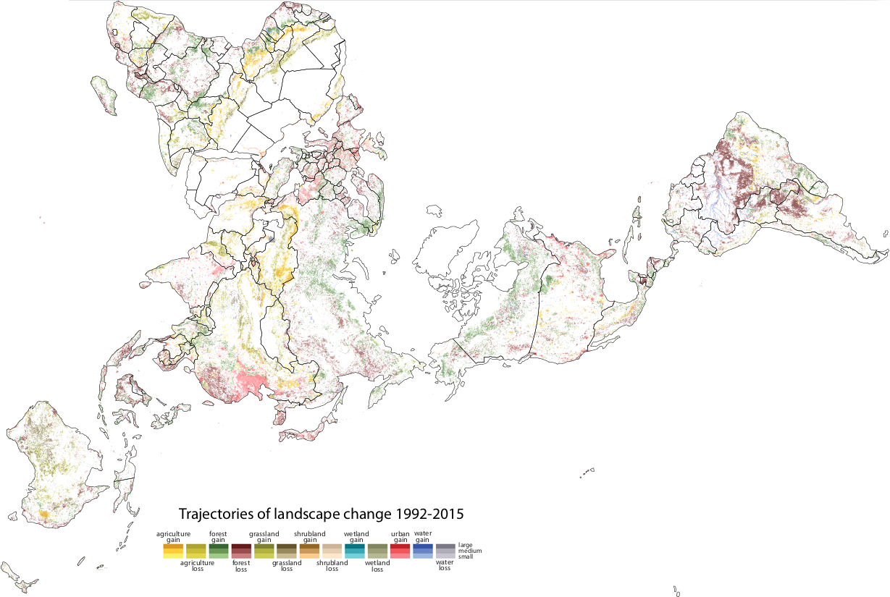
```

- **Nowosad, J., Stepinski, T.**, 2018. *Global changes in landscapes between 1992 and 2015*. http://doi.org/10.5281/zenodo.1323780


---
layout: false
class: middle, center

# Segmentation

---
### Segmentation

- Spatial patterns are an underexplored venue of the Earth and ecological sciences. They could be both an effect of some processes and at the same time affect other ones. For example, a land cover pattern (spatial arrangement of land cover categories) could exist because of an impact of a terrain topology, soils, climate, or human action. Next, this pattern can influence abiotic (e.g. some land cover patterns can be better to prevent erosion and flood than others) and biotic (e.g. some land cover patterns creates habitats for certain animals) components.

- Although patterns are sometimes easy to see on a map, their delineation is difficult. Probably the most crucial obstacle is the undefinability of patterns’ borders. There is not a ground truth that enables you to validate which areas have a homogenous pattern and where the line between two patterns should be drawn. Moreover, several practical problems exist - manual delineation of patterns is inconsistent, very often bias and hardly reproducible as different people have different definitions of patterns in their minds. On top of that there is an issue of time - how long would it take to create a detailed pattern-based regionalization on a global scale?

---
### Segmentation

.left-column2[**GeoPAT 2** provides a fast, consistent, but also a highly customizable way to regionalize space based on the underlining spatial patterns.
It also has methods to analyze the quality of the output regionalization.
The pattern-based segmentation process consists of three steps:

1. Creating a grid of motifels.
2. Regionalizing of homogeneous patterns.
3. Obtaining quality of the segmentation.]

.right-column2[
```{r, echo=FALSE, out.width=700, fig.align='center'}

```
]

---
### Segmentation - step 1

In the first step, we need to create a grid of motifels.

```{bash, eval = FALSE}
gpat_gridhis -i cci_lc2015.tif -o patterns2015.grd -z 25 -f 25 -s cooc 
```

- The `patterns2015.grd` grid contains a large number of [motifels](/post/pattern-based-spatial-analysis-core-ideas/#motiel) that are represented by the spatial coocurrence of categories.
- Motifels are rectangles of 7,500 by 7,500 meters (`-z 25`: 25 pixels x map resolution of 300 meters) covering the whole area of Australia. 
- However, you need to keep in mind that they are going to be converted into "brick" blocks of 15,000 by 15,000 meters in the segmentation step.
- More about the "brick" topology in a moment...

---
### Segmentation - step 2

The second step is to create regions of homogeneous patterns using the output of the first step.
Segmentation result depends on several parameters:

- `-i` - an input grid of motifels (output from the first step)
- `-o` - a name of the output GeoTIFF file - the result in a raster format
- `-v` - a name of the output GeoPackage file - the result in a vector format
- `-m` - selected [**similarity metric**](read [the previous blog post](/post/pattern-based-spatial-analysis-core-ideas) to learn more about **similarity metrics**)
- `--lthreshold` - minimum distance threshold to build areas (see the examples below). It controls segments' sizes
- `--uthreshold` - maximum distance threshold to build areas (see the examples below). It prevents the growth of
inhomogeneous segments
- `--swap` - improve segmentation by swapping unmatched areas. 0 forces repetition until all unmatched segments will be swapped, while 1 skip this process
- `--minarea` - suppress creation of segments smaller than the set value
- `--maxhist` - decide how many neighbors are used to calculate similarity. When 0 is set it uses all of the neighbors, which can be time-consuming
- `-q` - set the root topology instead of the brick topology (see the examples below)
- `-t` - segmentation can be a computationally demanding process. This option allows using multiple CPU threads

Additional parameters are either experimental (`--weights`) or are used mostly for diagnostics purposes (`-g`, `-r`).
Before digging deep into the parameters, let's try and leave the default values of most of them:

```{bash, eval = FALSE}
gpat_segment -i patterns2015.grd -o segments2015.tif -v segments2015.gpkg -m jsd -t 3
```

---
### Segmentation - step 2

.left-column2[
- Using only three CPU threads, this process should take about four minutes on a modern laptop for the whole area of Australia.
- The result of the pattern-based segmentation consists of a large number of regions of varied size.
Some of them are relatively small (one motifel) - they are different from the surrounding, while others span over large areas.
- To make it easier to see how segmentation works, let's focus on the area in north-eastern Australia defined by the red rectangle:
]

.right-column2[
```{r, echo=FALSE, out.width=550, fig.align='center'}

```
]

---
### Segmentation - step 2

.left-column2[
- One of the most important concepts here is the way how motifels are created.
- Segmentation differs in this element from the rest of the spatial pattern-based analysis, as it uses so-called "brick topology".
- Before the segmentation process can even start, grid created in the first step is transformed into a set "bricks" consisting of four motifels that are laid in alternate layers (see the figure below).
- Therefore, when you set the size to 25 in the first step, the segmented motifels would have a size of 50 by 50 cells (four motifels of 25 by 25).
- The "brick" topology allows creating segments using 6-connectivity, which gives better results than a simple 4-connectivity.
]

.right-column2[
```{r, echo=FALSE, fig.cap="Segmentation output on the top of a land cover map for an area in north-eastern Australia", out.width=500, fig.align='center'}

```
]

---
### Segmentation - step 2

Segmentation process consists of several steps that are explained in the ["Multi-scale segmentation algorithm for pattern-based partitioning of large categorical rasters"](https://eartharxiv.org/smva7/) article.

However, the most basic part to understand is how the segment growing works.
We start from one motifel and calculate its similarity with all of the adjacent motifels.
Next, we merge it with the most similar one and this process is repeated until we get to the threshold value:

```{r, echo=FALSE, fig.cap="Illustration of the segment growing process", out.width=800, fig.align='center'}

```

---
### Segmentation - step 3

As I have mentioned in the introduction, ground truth does not exist in the pattern-based regionalization. 
However, we can measure several properties of the output segments and they could give us an insight into how good our results are.

```{bash, eval = FALSE}
gpat_segquality -i patterns2015.grd -s segments2015.tif -g inhomogeneity2015.tif -o isolation2015.tif
```

All of them have values between 0 and 1.
The most important first-order property is inhomogeneity, which tells how internally inconsistent each segment is.
Our main goal of segmentation is to obtain regions of homogeneous patterns, therefore we want this value to be as low as possible. 

```{r, echo=FALSE, fig.cap="Inhomogeneity of the example segmentation", out.width=500, fig.align='center'}

```

---
### Segmentation - step 3

Secondary property of segmentation is isolation - we want regions that are distinct from their surroundings and therefore we aim for high values of isolation.
However, you need to keep in mind that inhomogeneity and isolation are not equally important. 
You may want to obtain regions of homogeneous patterns that are not drastically isolated from surroundings, however isolated yet inhomogenous regions are usually meaningless.

```{r, echo=FALSE, fig.cap="Isolation of the example segmentation", out.width=500, fig.align='center'}
knitr::include_graphics("figs/segmentation04b.png")
```

---
### Segmentation - step 3

Finally, segmentation quality can be calculated as:

$$1 - (inhomogeneity/isolation)$$

It gives an overall metric of the output, where the larger the value the better.

```{r, echo=FALSE, fig.cap="Quality of the example segmentation", out.width=500, fig.align='center'}

```

---
### Segmentation control

Pattern-based segmentation is a complex operation and visibly depends on several parameters mentioned above.
Let's try to manipulate some of them and see the results:

```{bash, eval = FALSE}
# example B
gpat_segment -i patterns2015.grd -o segments2015_B.tif -v segments2015_B.gpkg -m jsd -t 3
--lthreshold=0.3 --uthreshold=0.5
# example C
gpat_segment -i patterns2015.grd -o segments2015_C.tif -v segments2015_C.gpkg -m jsd -t 3 
--minarea=6
# example D
gpat_segment -i patterns2015.grd -o segments2015_D.tif -v segments2015_D.gpkg -m jac -t 3
# example E
gpat_gridhis -i cci_lc2015.tif -o patterns2015_100.grd -s cooc -z 100 -f 100
gpat_segment -i patterns2015_100.grd -o segments2015_E.tif -v segments2015_E.gpkg -m jsd -t 3 -q
```

---
### Segmentation control

```{r, echo=FALSE, fig.cap="Five examples of segmentation with a different set of parameters", out.width=850, fig.align='center'}

```

<!-- Example A uses the default values of the segmentation. -->
<!-- In the second example (B), we increased values of two parameters, `--lthreshold` and `--uthreshold`. -->
<!-- The first controls how homogenous the output regions should be in terms of patterns, with larger values indicating more inhomogenous regions (which also means larger regions/smaller number of segments). -->
<!-- The second one prevents the growth of too large inhomogeneous segments. -->
<!-- Example C has the `--minarea` parameter set to 6, which suppress creation of segments with fewer motifels than the set number. -->
<!-- In example D, we used Jaccard distance, a different similarity measure.  -->
<!-- It gave fairly similar results to the Janson-Shannon divergence but different in details. -->
<!-- And finally, example E used a root topology (also know as 4-connectivity).  -->
<!-- In the growing stage, it can only use neighbors from the left, right, top, and bottom. -->
<!-- As a result, the output segmentation seems more clunky and the segments are aligned along horizontal and vertical lines. -->

---
### Segmentation - code

<!-- explain -->

```{bash, eval = FALSE}
gpat_gridhis -i cci_lc2015.tif -o patterns2015.grd -z 25 -f 25 -s cooc
gpat_segment -i patterns2015.grd -o segments2015.tif -v segments2015.gpkg -m jsd -t 3
gpat_segquality -i patterns2015.grd -s segments2015.tif -g inhomogeneity2015.tif -o isolation2015.tif
```

---
### Segmentation - resources

- **Nowosad, J. and Stepinski, T. F.**, 2018. *Towards machine ecoregionalization of Earth's landmass using pattern segmentation method*. International Journal of Applied Earth Observation and Geoinformation, 69, pp.110-118.
- **Nowosad, J. and Stepinski, T. F.**, 2018. *Global inventory of landscape patterns and latent variables of landscape spatial configuration*. Ecological Indicators, 89, pp.159-167.
- **Jasiewicz, J., Stepinski, T., & Niesterowicz, J.**, 2018. Multi-scale segmentation algorithm for pattern-based partitioning of large categorical rasters. Computers & Geosciences.
- **Niesterowicz, J. and Stepinski, T.F.**, 2017. *Pattern-based, multi-scale segmentation and regionalization of EOSD land cover*. International Journal of Applied Earth Observation and Geoinformation, 62, pp.192-200.
- **Niesterowicz, J., Stepinski, T.F. and Jasiewicz, J.**, 2016. *Unsupervised regionalization of the United States into landscape pattern types*. International Journal of Geographical Information Science, 30(7), pp.1450-1468.
- **Stepinski, T.F., Niesterowicz, J. and Jasiewicz, J.**, 2015. *Pattern-based regionalization of large geospatial datasets using complex object-based image analysis*. Procedia Computer Science, 51, pp.2168-2177.

---
layout: false
class: middle, center

# Clustering

---
### Clustering

<!-- - Segmentation merges the most similar local patterns and creates  -->
<!-- - On the other hand, clustering... -->
- **GeoPAT 2** calculates similarity matrices between motifels, points, or polygons using `gpat_distmtx`. 
- It accepts outputs from `gpat_grid2txt`, `gpat_pointshis`, or `gpat_polygon` and returns a CSV file containing a similarity matrix - also known as a distance matrix.
- In this example, we focus on the output from `gpat_grid2txt`.
- Read [the GeoPAT 2 manual](https://zenodo.org/record/1291123) to see examples of clustering based on the output of `gpat_pointshis` and `gpat_polygon`.

```{bash, eval=FALSE}
gpat_gridhis -i cci_lc2015.tif -o patterns2015.grd -s prod -z 200 -f 200
gpat_grid2txt -i patterns2015.grd -o patterns2015.txt
gpat_distmtx -i patterns2015.txt -o similarity2015.csv
```

- The output, `similarity2015.csv`, can be read into your preferable software to apply any clustering method that depends on a distance matrix.

---
### Clustering

- For example, use the `gpat_read_distmtx()` function from the **rgeopat2** package to read the data into R:

```{r, eval=FALSE}
dist_2015 = gpat_read_distmtx("similarity2015.csv")
```

- This new object, `dist_2015`, is of the `dist` class and therefore can be used by many clustering functions, including hierarchical clustering (`hclust()`), or k-medoids clustering methods (`cluster::pam()`).

- Let's try a simple example:

<!-- maybe add some comments -->

```{r, eval=FALSE}
# based on the dissimilarity matrix output of GeoPAT 2, 
# motifels are clustered using hierarchical clustering method
hclust_result = hclust(d = dist_2015, method = "ward.D2")
# the dendrogram visualization
plot(hclust_result, labels = FALSE)
rect.hclust(hclust_result, k = 12, border = "blue")
# the data is divided into 12 clusters
hclust_cut = cutree(hclust_result, 12)
# a spatial object containing a grid of motifels is created
my_grid = gpat_create_grid("patterns2015.grd.hdr")
# identifiers of the new clusters are added to our spatial object containing a grid of motifels
my_grid$class = hclust_cut
plot(my_grid["class"])
```

---
### Clustering

- We cluster motifels based on the dissimilarity matrix output of GeoPAT 2 using hierarchical clustering (function `hclust()`).
- Based on the dendrogram visualization (`plot()`), we decide that the data should be divided into 12 clusters (`cutree()`):

```{r, echo=FALSE, fig.cap="Dendrogram representing hierarchical clustering", out.width=700, fig.align='center'}

```

---
### Clustering

.left-column2[
- Finally, we add identifiers of the new clusters to our spatial object containing a grid of motifels and visualize it:
]

.right-column2[
```{r, echo=FALSE, fig.cap="A map of Australia divided into twelve clusters based on the similarity of land cover composition", out.width=600, fig.align='center'}
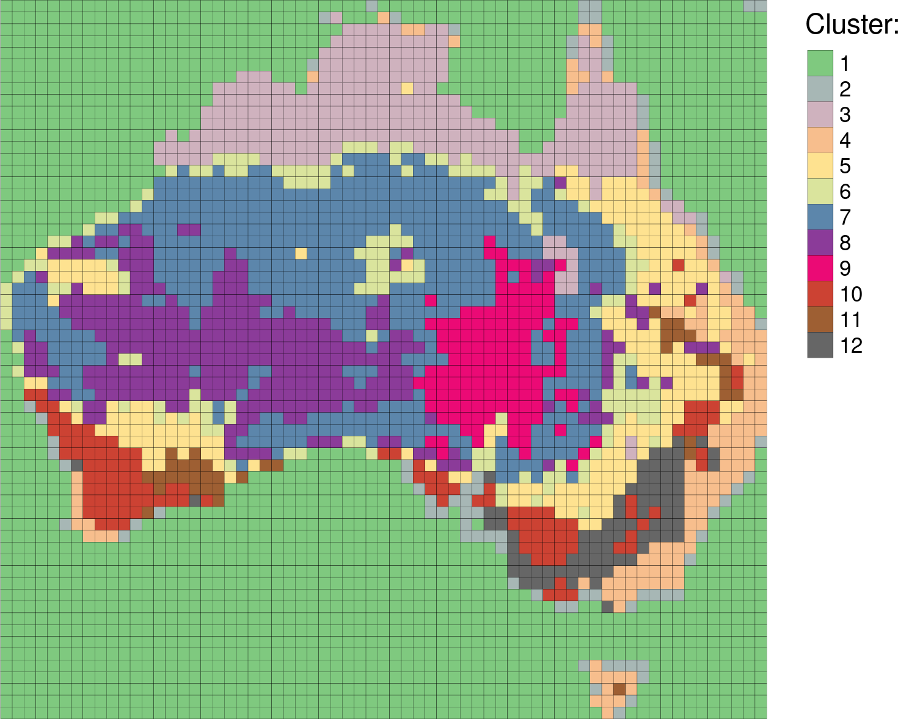
```
]

<!-- The output is a map with motifels grouped into the areas of the similar land cover composition. -->
<!-- Some of the clusters represent one dominant land cover category, e.g. cluster 1 is water, cluster 3 is shrubland, and cluster 7 is sparse vegetation. -->
<!-- On the other hand, some of the clusters can consist of many land cover categories. -->
<!-- For example, cluster 6 is a mosaic of grassland and sparse vegetation and cluster 8 is a mosaic of sparse vegetation and shrubland. -->

---
### Clustering - code

Step 1. Creating a grid of motifels.

```{bash, eval=FALSE}
gpat_gridhis -i cci_lc2015.tif -o patterns2015.grd -s prod -z 200 -f 200
```

Step 2. Converting the output grid file into a text file that can be read by standard software, such as R, Python, Excel.
It can be also used in some **GeoPAT 2** workflows.

```{bash, eval=FALSE}
gpat_grid2txt -i patterns2015.grd -o patterns2015.txt
```

Step 3. Calculating a similarity matrix between motifels

```{bash, eval=FALSE}
gpat_distmtx -i patterns2015.txt -o similarity2015.csv
```

---
### Clustering - R code

- Based on the dissimilarity matrix output of GeoPAT 2, motifels are clustered using hierarchical clustering method

```{r, eval=FALSE}
hclust_result = hclust(d = dist_2015, method = "ward.D2")
```

- The dendrogram is visualized

```{r, eval=FALSE}
plot(hclust_result, labels = FALSE)
rect.hclust(hclust_result, k = 12, border = "blue")
```

- The data is divided into 12 clusters

```{r, eval=FALSE}
hclust_cut = cutree(hclust_result, 12)
```

- A spatial object containing a grid of motifels is created

```{r, eval=FALSE}
my_grid = gpat_create_grid("patterns2015.grd.hdr")
```

- Identifiers of the new clusters are added to our spatial object containing a grid of motifels

```{r, eval=FALSE}
my_grid$class = hclust_cut
plot(my_grid["class"])
```

---
layout: false
class: middle, center

# Extendibility

---
### Extendibility

GeoPAT 2 gives its users a lot of freedom, having a large number of possible workflows:

```{r, echo=FALSE, fig.cap="Outline of the GeoPAT 2 architecture", out.width=700, fig.align='center'}
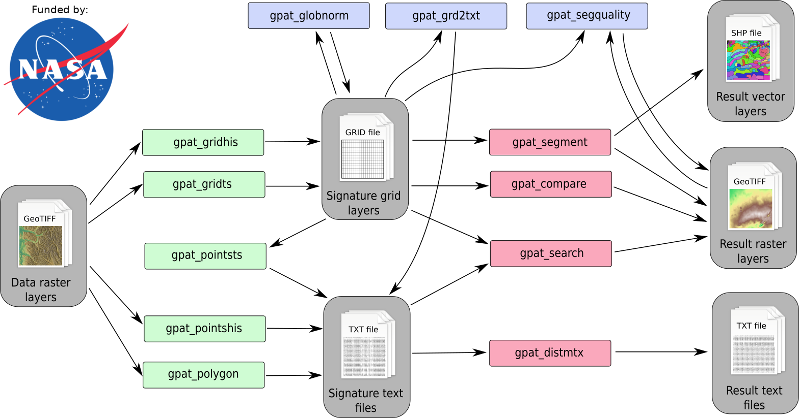
```

Some of them can consist of only one step, while others require several steps.
However, that is not the end of GeoPAT 2 capabilities - it is also possible to extract spatial signature or calculate distance matrix and use these outputs in further analysis outside of GeoPAT 2.
For example, you can cluster areas of similar patterns or use machine learning methods to find numerical relationships between patterns descriptors and other variables.
Finally, there are several experimental features of GeoPAT 2, including a set of methods for analysis of spatiotemporal data.

---
### Extracting information about spatial patterns

Most of the GeoPAT 2 modules depends on spatial information about patterns in the form of [signatures](/post/pattern-based-spatial-analysis-core-ideas/#signature).
We can then [find the most similar signatures (search)](/post/geopat-2-search), [compare local signatures (comparison)](/post/geopat-2-compare), or [merge areas with similar signatures (segmentation)](/post/geopat-2-segmentation). 
This information can be also used outside of GeoPAT 2 - it is possible to fit a spatial pattern information to your own workflow.

There are three main ways to extract information about spatial patterns.
The first one extracts information from a regular grid of motifels.
In the example below, we create a grid of motifels with information about the composition of land cover categories (`-s prod`).
Next, using `gpat_grid2txt` we convert the output grid file into a text file that can be read by standard software, such as R, Python, Excel.

```{bash, eval=FALSE}
gpat_gridhis -i cci_lc2015.tif -o patterns2015.grd -s prod -z 200 -f 200
gpat_grid2txt -i patterns2015.grd -o patterns2015.txt
```

---
### Extracting information about spatial patterns

The second one extracts a spatial pattern information based on point coordinates within the given buffer.
Below, we extract a land cover composition (Cartesian product) of a square area of 30 by 30 pixels (9km by 9km) around Australia's capital - Canberra:

```{bash, eval=FALSE}
gpat_pointshis -i cci_lc2015.tif -o patterns_pts.txt -s prod -z 30 -x 1370000 -y -4050000
```

---
### Extracting information about spatial patterns

The third one involves extracting information about spatial patterns using irregular polygons with `gpat_polygon`.
Let's say, we are interested in extracting land cover composition in each of TNC's terrestrial ecoregions in Australia.
*(Due to large sizes of some ecoregions, the below calculation can require about 16GB RAM available.)*

```{bash, eval=FALSE}
gpat_polygon -i cci_lc2015.tif -e tnc_terr_ecoregions.tif -o patterns_poly.txt -s prod
```

---
### Extracting information about spatial patterns

To ease some of the non-standard GeoPAT 2 operations we created an R package called **rgeopat2**.

```{r, eval=FALSE}
library(rgeopat2)
```

Its function `gpat_read_txt()` reads the output text from GeoPAT 2 and formats it in a convinent way:

```{r, eval=FALSE}
patterns_poly = gpat_read_txt("patterns_poly.txt")
```

```{r, eval=FALSE, echo=FALSE}
knitr::kable(patterns_poly[c(1, 34), ], digits = 2, caption = "Example of two lines from the gpat_read_txt() output")
```

*Table: Example of two lines from the gpat_read_txt() output*

|   |   X1|   X2| X3|   X4|   X5|   X6|   X7|   X8|   X9| X10|  X11| X12|  X13|  X14|  X15|  X16| X17|  X18|  X19|  X20| X21|  X22|   cat|
|:--|----:|----:|--:|----:|----:|----:|----:|----:|----:|---:|----:|---:|----:|----:|----:|----:|---:|----:|----:|----:|---:|----:|-----:|
|1  | 0.00| 0.00|  0| 0.00| 0.00| 0.00| 0.00| 0.00| 0.00|   0| 0.00|   0| 0.00| 0.00| 0.00| 0.00|   0| 0.00| 0.00| 0.00|   0| 1.00|     0|
|34 | 0.00| 0.00|  0| 0.00| 0.00| 0.00| 0.00| 0.00| 0.00|   0| 0.00|   0| 0.00| 0.00| 0.54| 0.45|   0| 0.00| 0.00| 0.00|   0| 0.00| 10072|

The last column in this table, `cat`, represents the id of the terrestrial ecoregion, while the rest of the columns are the land cover categories.
For example, `cat` 0 is an ocean and 100% of its area is covered by water (class X22), while `cat` 10072, Gibson Desert, is located in the middle of the continent and is covered by grassland (X15) and sparse vegetation (X16).

---
### Spatiotemporal pattern-based analysis

.left-column2[
GeoPAT 2 also offers several additional features, including spatiotemporal pattern-based analysis.
It is highly experimental, but already can be executed and tested.
Let's take a look at a couple examples from [the GeoPAT 2 manual](https://zenodo.org/record/1291123).

The input data is a set of twelve rasters of monthly sums of precipitation for the area of the British Isles from [the WorldClim database](http://www.worldclim.org/). 
Each raster has 76560 pixels (240 rows and 319 columns).
In other words, each pixel has 12 values representing temporal precipitation pattern.
]

.right-column2[
```{r, echo=FALSE, fig.cap="Monthly sums of precipitation for the area of the British Isles", out.width=550, fig.align='center'}

```
]

---
### Spatiotemporal pattern-based analysis

.left-column2[
Many **GeoPAT 2** methods for spatial data also work with spatiotemporal datasets.
For example, it is possible to regionalize the British Isles based on its annual precipitation patterns.
Each region has similar temporal precipitation pattern.
]

.right-column2[
```{r, echo=FALSE, fig.cap="Regions of the similar annual precipitation patterns for the British Isles", out.width=400, fig.align='center'}
knitr::include_graphics("figs/extend04b.png")
```
]

---
### Spatiotemporal pattern-based analysis

.left-column2[
Another **GeoPAT 2** application is clustering of spatiotemporal data.
For example, we can extract temporal precipitation patterns of 97 largest cities in the British Isles and cluster them:
]

.right-column2[
```{r, echo=FALSE, fig.cap="Example of a time series clustering", out.width=750, fig.align='center'}

```
]

---
layout: false
class: middle, center

# Conclusions

---
### Conclusions

.pull-left[
```{r, out.width="375px", echo=FALSE, fig.cap="Example: Global land cover patterns were segmented into homogeneous areas and their patterns were analysed with landscape metrics. The results showed a dependence of land cover spatial configuration on two parameters, complexity (C) and aggregation (A)."}

```

]

.pull-right[
- **Global environmental changes** -- analysis of changes in patterns of different environmental features, such as land cover 
- **Global ecology** - delineation of ecoregions -- regionalization of land into homogeneous units of similar ecological and physiographic features (land cover, landform, soils, climate)
- **Forestry** - regionalization of forest patterns -- results could be used for conservation, planning, and management
- **Agriculture** - identification of spatial patterns of cropland usage
- **Ecology**
- **Landscape ecology** - inventory of landscape patterns and analysis of landscape spatial configuration
]

---
### Conclusions

- The pattern-based spatial analysis uses **blocks of pixels (motifels)** to represent a local pattern
- This way **a large number of small simple cells are transformed into a smaller number of large complex cells**
- This approach allows for **searching, detecting changes, segmentation, and clustering** of local patterns
- Main ideas behind the pattern-based spatial analysis are implemented in **GeoPAT 2.0**
- **The GeoPAT 2.0 software** and its **user’s manual** are available through the Space Informatics Lab website at http://sil.uc.edu
- GeoPAT **does not require supercomputer or cloud computing** because core calculations are performed on grid orders of magnitude smaller than a grid of original data
- GeoPAT also allows for **temporal analysis** of large spatial datasets (see [the manual](http://doi.org/10.5281/zenodo.1185408))
- If you want to learn more about the pattern-based spatial analysis read [the official GeoPAT 2 manual](https://zenodo.org/record/1291123). 
It contains installation instructions, description of the GeoPAT 2 architecture, several workflow paths with examples, and explanations of numerical signatures, dissimilarity measures, and topologies available in GeoPAT 2.

We also encourage users to submit issues and enhancement requests so we may continue to improve our software. 
Furthermore, if you have any question related to GeoPAT 2 please email me at nowosad.jakub@gmail.com.

---
## Additional resources

The blog post series introducing [GeoPAT 2 - a software for pattern-based spatial and temporal analysis](http://sil.uc.edu/cms/index.php?id=geopat2) are:

1. [GeoPAT 2: Software for Pattern-Based Spatial and Temporal Analysis](/post/geopat-2-software-for-pattern-based-spatial-and-temporal-analysis)
2. [Pattern-based Spatial Analysis - core ideas](/post/pattern-based-spatial-analysis-core-ideas)
3. [Finding similar local landscapes](/post/geopat-2-search)
4. [Quantifying temporal change of landscape pattern](/post/geopat-2-compare)
5. [Pattern-based regionalization](/post/geopat-2-segmentation)

If you want to learn more about the pattern-based spatial analysis read [the official GeoPAT 2 manual](https://zenodo.org/record/1291123). 
It contains installation instructions, description of the GeoPAT 2 architecture, several workflow paths with examples, and explanations of numerical signatures, dissimilarity measures, and topologies available in GeoPAT 2.


- **Jasiewicz, J., Netzel, P. and Stepinski, T.**, 2015.* GeoPAT: A toolbox for pattern-based information retrieval from large geospatial databases*. Computers & Geosciences, 80, pp.62-73.
- **Jasiewicz, J., Netzel, P. and Stepinski, T.F.**, 2014. *Landscape similarity, retrieval, and machine mapping of physiographic units*. Geomorphology, 221, pp.104-112.
- **Jasiewicz, J. and Stepinski, T.F.**, 2013. *Example-based retrieval of alike land-cover scenes from NLCD2006 database*. IEEE Geoscience and Remote Sensing Letters, 10(1), pp.155-159.

---
layout: false
class: inverse, middle, center

```{r, include=FALSE, eval=FALSE}
devtools::install_github("ropenscilabs/icon")
```

## Thank you

.pull-left[
## Me:

Twitter: `r icon::ii_social_twitter()` jakub_nowosad

Email: nowosad.jakub@gmail.com
]

.pull-right[
## Resources:

https://nowosad.github.io

http://sil.uc.edu
]

.footnote[
**Slides:** https://github.com/Nowosad/geostat18
]
