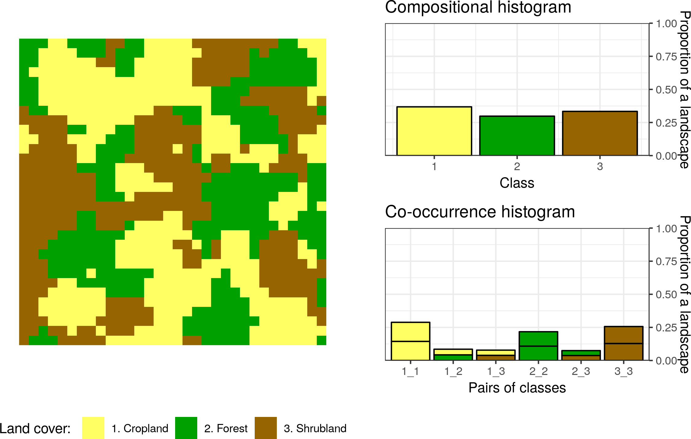

```{r setup, include=FALSE}
options(htmltools.dir.version = FALSE)
```

layout: false
class: middle, center

## Introduction

---
layout: false
class: middle, center

## Core ideas

---
### Motifel

- Most of the spatial raster analyses use single pixels as its main unit of analysis. <!--Each pixel has one value (e.g. land cover class) and relatively small size (e.g. 90 meters).--> The value of a single pixel can show a local property, however, it says nothing about a local spatial pattern.

- <!--Therefore, the question is how a local pattern can be depicted?--> In our approach, we consider a square block of pixels as a representation of a local pattern (“motif”). This block of pixels is called a motifel and it is an elementary unit of the pattern-based spatial analysis.

<!-- - In the figure below, you can see a land cover map divided into a set of motifels. Each motifel consists of a large number of pixels and depicts a local pattern.-->

```{r, echo=FALSE, fig.cap="An example of a grid divided into motifels", out.width=800, fig.align='center'}

```

---
### Motifel

It is worth to mention that a simple rule to decide on a size of a motifel doesn’t exist. The decision depends on the input data (e.g. its resolution, number of classes), type of a pattern, its variability, etc. However, a rule of thumb is to look closely at your data and keep in mind two things:

1. There should be enough pixels to create a pattern. That is why GeoPAT 2 does not allow for a mofitels smaller than 10 by 10 pixels.
2. Single motifels usually should not encapsulate many different patterns.

---
### Signature

.left-column2[
- **Motifel** is a spatial data representation preferable by humans as our pattern processing capabilities were improved in millions of years of evolution.
However, computers cannot see patterns in the same way as we do, and we need to transform the spatial pattern data into a form recognizable by machines.
Fortunately, there are many ways to do so and GeoPAT 2 offers some of them.
They are called **signatures**.
]

.right-column2[
```{r, echo=FALSE, fig.cap="LALA", out.width=500, fig.align='center'}
knitr::include_graphics("figs/02_signatures_examples0.png")
```
]

---
### Signature

```{r, echo=FALSE, fig.cap="LALA", out.width=500, fig.align='center'}

```

- The simplest **signature** of a motifel is its composition (Cartesian product, `prod`) - a number of cells of each map category.
It is a very compact representation, although it doesn't contain information related to the configuration of categories. 
This is a role for the following **signature** - spatial co-occurrence of categories (`cooc`).
Spatial co-occurrence of categories is a $k$ by $k$ square matrix, where $k$ is a number of classes in a landscape.
Class co-occurrence matrix counts a number of pairs of classes assigned to neighboring cells.
Next, the co-occurrence matrix is transformed into a normalized co-occurrence histogram.
In this **signature**, a landscape with $k$ classes can be represented by the co-occurrence histogram of $(k^2 + k)/2$ elements.
Importantly, a $k$ number of them is related to the class composition and $(k^2 - k)/2$ is related to the class configuration.

---
### Signature

```{r, echo=FALSE, fig.cap="LALA", out.width=500, fig.align='center'}

```

<!--Take a look at the example above and compare information depicted by the compositional and co-occurrence histograms.
The first one shows that each land cover category occupies a very similar proportion of the area.
The second one provides more information - it counts how often different categories are adjacent to each other.
These histograms also have some important properties - rotated or mirrored version of a landscape will still have the same non-spatial representation.-->

The **signatures** mentioned above are suitable for a numeric comparison between **motifels** using **similarity metrics** (more about them below).
There are three additionals **signatures** - "landscape indices" (`lind`), "selected landscape indices" (`linds`), and "Shannon entropy" (`ent`), and their role is mostly limited to describing motifels.

---
### Similarity metric

.left-column2[
- Two of the **signatures** mentioned above, `prod` and `cooc`, have a special power - they allow for comparisons between any pair of motifels. 
In a similar way, as a human can look at two images and decide if they are similar or not, GeoPAT 2 can take two motifels and compare their **signatures**. 
It also has important advantages comparing to a human perception. 
Firstly, the GeoPAT 2 results are consistent and reproducible, while human perception can be erratic and differs between individuals.
Secondly, GeoPAT 2 gives a numerical value of similarity between two motifels.
]

.right-column2[
```{r, echo=FALSE, fig.cap="LALA", out.width=500, fig.align='center'}
knitr::include_graphics("figs/03_motifel_signatures.png")
```
]

---
### Similarity metric

.left-column2[
- To calculate a similarity between them we need to have a way to measure how these histograms are alike. 
GeoPAT 2 has several **similarity metrics** that were build to compare two histograms.
<!--This numerical value depends on a selected similarity metric.-->
It includes Jensen Shannon divergence (`jsd`), Triangular (`tri`),  Wave-Hedges distance (`wh`), and Jaccard distance (`jac`).
They are explained in detail in [the GeoPAT 2 manual](https://zenodo.org/record/1291123).
]

.right-column2[
```{r, echo=FALSE, fig.cap="LALA", out.width=500, fig.align='center'}
knitr::include_graphics("figs/03_motifel_signatures.png")
```
]

---
### Similarity metric

.left-column2[
```{r, echo=FALSE, warning=FALSE}
jsd_result = structure(list(V1 = c(0, 0.114750416014047, 0.00293772511887314),
                            V2 = c(0.114750416014047, 0, 0.089399714585066),
                            V3 = c(0.00293772511887314, 0.089399714585066, 0)), 
                       row.names = c(NA, -3L), class = c("tbl_df", "tbl", "data.frame"))
knitr::kable(jsd_result, 
             digits = 3,
             row.names = c(1, 2, 3),
             col.names = c(1, 2, 3),
             caption = "Comparision of the Jensen Shannon divergence values between the example motifels (landscapes)", format = "html")
```

- I've calculated the Jensen Shannon divergence values between the three examples from the above figure.
The smaller this value is the more similar are two **motifels**.
The results are, as expected, consistent with the human perception. 
The first and third motifel are the most similar with the `jsd` value of 0.003 - both motifels have only three categories and their patterns are analogous.
The second motifel is less similar to both the first one (the `jsd` value of 0.115) and the third one (the `jsd` value of 0.089). 
It has an additional land cover category ("grassland"), different proportions of land cover categories and their configurations.
]

.right-column2[
```{r, echo=FALSE, fig.cap="LALA", out.width=500, fig.align='center'}
knitr::include_graphics("figs/03_motifel_signatures.png")
```
]

---
layout: false
class: middle, center

## Search

---
layout: false
class: middle, center

## Compare

---
layout: false
class: middle, center

## Segmentation

---
layout: false
class: middle, center

## Clustering

---
layout: false
class: middle, center

## Extendibility

---
layout: false
class: middle, center

## Conclusions

---
layout: false
class: inverse, middle, center

```{r, include=FALSE, eval=FALSE}
devtools::install_github("ropenscilabs/icon")
```

## Thank you

.pull-left[
## Me:

Twitter: `r icon::ii_social_twitter()` jakub_nowosad

Email: nowosad.jakub@gmail.com
]

.pull-right[
## Resources:

https://nowosad.github.io

http://sil.uc.edu
]

.footnote[
**Slides:** https://github.com/Nowosad/geostat18
]
